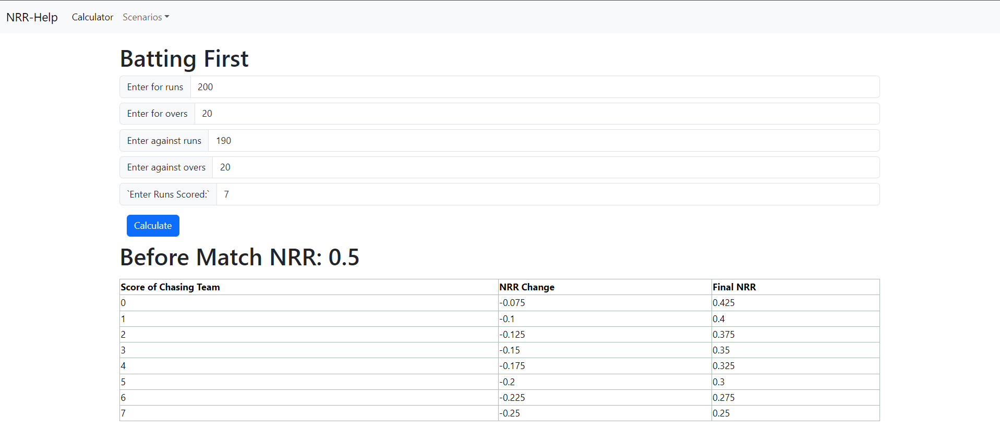

# NRR-Scenario-Calculator

This app helps people to calculate Net Run Rate (NRR), and also analyse how the Net Run Rate will behave in different scenarios. The Net Run Rate of a team in a match is calculated by deducting the number of runs conceded by that team per over in that tie from the average number of runs it scores per over in that contest. So, essentially, it's the run rate of that team in the match minus the run rate of the opposition team. 

# Terms Related to Net Run Rate

- **FOR:** The "FOR" term in Net Run Rate refers to the performance metrics of the team in focus. 

  - **For Runs:** "For Runs" indicates the total number of runs scored by the team in the league.

  - **For Overs:** "For Overs" indicates the total number of overs bowled by the team in the league.

- **AGAINST:** The "AGAINST" term in Net Run Rate refers to the performance metrics of the opposing team.

  - **Against Runs:** "Against Runs" indicates the total number of runs scored against the team in the league.

  - **Against Overs:** "Against Overs" indicates the total number of overs bowled against the team in the league.

## Example

For example, A FOR of 2232/209.0 and AGAINST of 1996/216.2 means the following:

- FOR Runs: 2232
- FOR Overs: 209.0
- AGAINST Runs: 1996
- AGAINST Overs: 216.2

To calculate the NRR using these metrics, follow these steps:

1. Calculate the run rate for the team:
   - For Team: FOR Runs / FOR Overs = 2232 / 209.0 = 10.67 runs per over
   - Against Team: AGAINST Runs / AGAINST Overs = 1996 / 216.2 = 9.23 runs per over

2. Deduct the run rate of the opposing team from the run rate of the team in focus:
   - NRR = (For Team Run Rate) - (Against Team Run Rate)
   - NRR = 10.67 - 9.23 = 1.44

So, the Net Run Rate (NRR) for the team in consideration is 1.44.

# App Features

## Calculator

Input the FOR and AGAINST of the team you want to calculate the Net Run Rate of and you will get the Net Run Rate!

## Batting First Scenario Calculator

Imagine your team has batted first and scored X runs. If you want to know by how much your teams Net Run Rate will increase or decrease based on how on how many runs the opponent team loses by or by how many overs to spare the opponent team wins by, then use this calculator.

Just input the parameters before the game and the runs scored by your team into the calculator!

## Batting Second Scenario Calculator

Imagine the opponent team has batted first and scored X runs. If you want to know by how much your teams Net Run Rate will increase or decrease based on how many overs and how many runs your team scores when chasing the target down, then use this calculator.

Just input the parameters before the game and the runs scored by the opponent team into the calculator!

## App Interface

